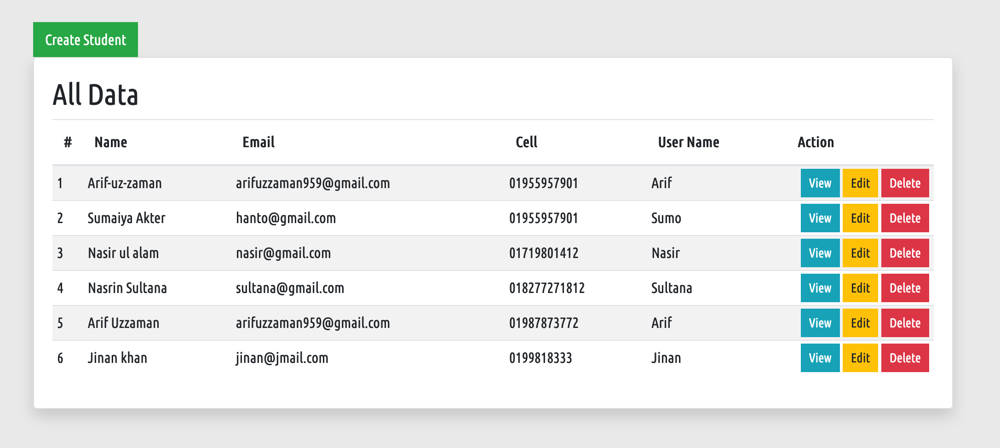
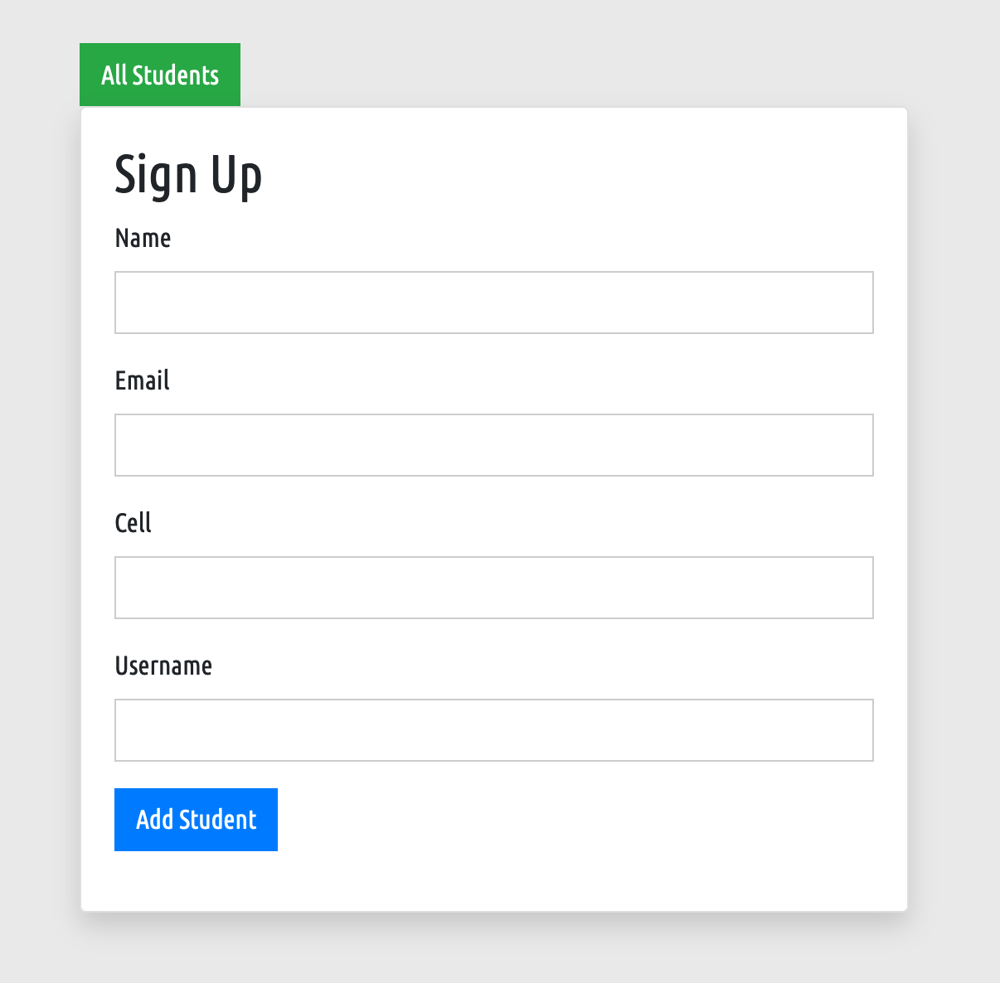

# Student Crud Application system by OOP (PHP)



## Freatures
=============
- Student add to database
- Student all data show
- Student data edit
- Student data Delete
- Student data Update

### Database class Design
============================

```php
namespace App\Supports;

use mysqli;

/**
 * Database Class
 */

 class Database{
     
    /**
     * Private Properties
     */

     private $host = "localhost";
     private $user = "root";
     private $pass = "root";
     private $db = "students";
     private $connection;

     private function connection(){

        return $this -> connection = new mysqli($this -> host, $this -> user, $this -> pass, $this -> db );
         
     }

     /**
      * Create student
      */

      protected function create($sql){
          
       return $this -> connection() -> query($sql);
        
      }

      /**
      * show all student
      */

      protected function all($table, $order = "DESC"){

        return $this -> connection() -> query("SELECT * FROM $table ORDER BY id $order");
          
    }

     /**
      * delete student
      */

      protected function delete($table, $id){

        return $this -> connection() -> query("DELETE FROM $table WHERE id = $id ");
          
    }

    /**
      * update student
      */

      protected function update($table, $id){
          
    }

     /**
      * find single student
      */

      protected function find($table, $id){
          
        return $this -> connection() -> query("SELECT * FROM $table WHERE id = $id ");
    }
 }

```

### Student all classes

```php

 namespace App\Controllers;

    use App\Supports\Database;

    /**
     * Student Class
     */

     class Student extends Database{

        public function studentinsert( $name, $email, $cell, $uname ){

            $this -> create(("INSERT INTO student (name, email, cell, uname ) VALUES ('$name','$email','$cell','$uname' ) "));
            
        }

        public function allstudent(){
            return $this -> all('Student','ASC');
        }

        /**
         * Student Delete
         */

         public function deleteStudent($deleteid){
             $this -> delete('student', $deleteid);
         }

         /**
          * View Student
          */

          public function viewStudent($view_id){
              return $this -> find('student',$view_id);
          }
        
     }

```

### JSON file

```php

{
    "name": "arif/crud",
    "description": "This project is for learning purpose",
    "type": "project",
    "license": "MIT",
    "authors": [{
        "name": "Arif",
        "email": "arifuzzaman959@gmail.com"
    }],
    "require": {},
    "autoload": {
        "psr-4": {
            "App\\": "app"
        }
    }
}

```